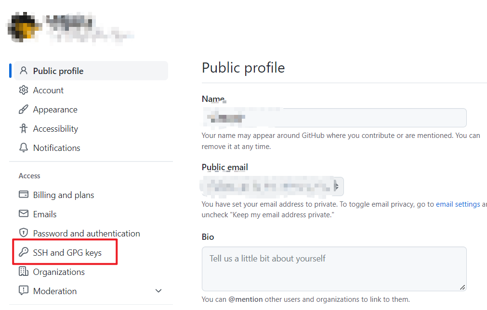
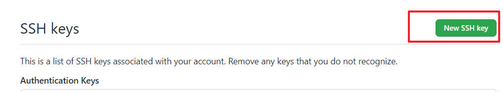
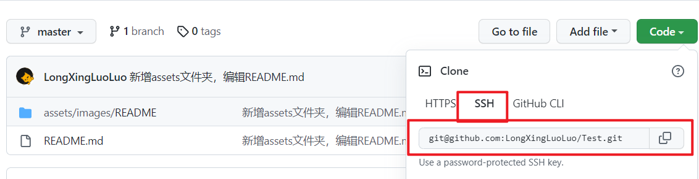

# 连接GitHub

## 建立Key

### 新建key

```shell
$ ssh-keygen -t rsa -C "****@**.com"
```

邮箱为GitHub账号邮箱


然后`$ cat C:\Users\Lxll\.ssh\id_rsa.pub` 复制key

## 设置GitHub

### 进入GitHub






粘贴key后完成

### 验证是否成功

```shell
$ ssh -T git@github.com
```

## 为本地仓库创建远程仓库



用`git remote add {远程仓库名} {远程仓库连接}`建立远程仓库

```shell
$ git remote add origin git@github.com:***/***
```

## 基础命令

### 上传到远程仓库

```shell
$ git push {远程仓库名} {分支}
```

### 查看当前的远程仓库

```shell
$ git remote
```

执行时加上 -v 参数，你还可以看到每个别名的实际链接地址。

### 提取远程仓库

#### 1.从远程仓库下载新分支与数据

```shell
$ git fetch
```

#### 2.从远端仓库提取数据并尝试合并到当前分支

```shell
$ git merge
```

该命令就是在执行 **git fetch** 之后紧接着执行 **git merge** 远程分支到你所在的任意分支。

### 删除远程仓库

```shell
$ git remote rm {远程仓库名}
```

